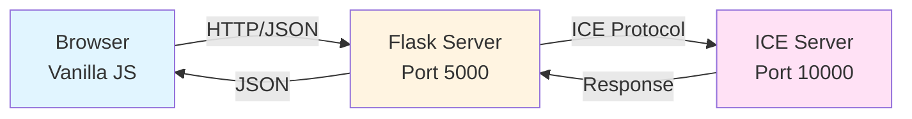

## System Overview

The Conversor de Unidades Remoto implements a **three-tier client-server architecture** using ZeroC Ice middleware for remote procedure calls (RPC). This design separates concerns and enables distributed computing across network boundaries.

<CardGroup cols={3}>
  <Card title="Frontend Layer" icon="browser">
    Vanilla JavaScript single-page application with real-time conversion and theming support
  </Card>
  <Card title="Flask Server" icon="server">
    Python web server that serves static files and proxies API requests to the ICE backend
  </Card>
  <Card title="ICE Server" icon="network-wired">
    ZeroC Ice RPC server handling business logic for unit conversions
  </Card>
</CardGroup>

## Architecture Diagram



## Component Interaction

<Steps>
  <Step title="User Input">
    User enters a value and selects conversion units in the browser interface. JavaScript captures the input through event listeners.
  </Step>
  
  <Step title="HTTP Request">
    Frontend sends a POST request to Flask server at `/api/convert` with JSON payload:
    ```json
    {
      "categoria": "temperatura",
      "valor": 100,
      "desde": "celsius",
      "hasta": "fahrenheit"
    }
    ```
  </Step>
  
  <Step title="ICE Proxy Call">
    Flask server uses ICE proxy to invoke remote method on ICE server:
    ```python
    resultado = self.proxy.convertirTemperatura(valor, desde, hasta)
    ```
  </Step>
  
  <Step title="Business Logic Execution">
    ICE server executes conversion algorithm and returns result as a double-precision float.
  </Step>
  
  <Step title="Response Chain">
    Result flows back through Flask to frontend as JSON:
    ```json
    {"resultado": 212.0}
    ```
  </Step>
  
  <Step title="UI Update">
    JavaScript updates the display and adds the conversion to history with smooth animations.
  </Step>
</Steps>

## Technology Stack

### Backend Technologies

| Component | Technology | Purpose |
|-----------|-----------|----------|
| RPC Middleware | ZeroC Ice 3.7+ | Remote procedure calls, marshalling, network transport |
| Web Framework | Flask 2.0+ | HTTP server, static file serving, REST API |
| Interface Definition | Slice Language | Language-agnostic RPC contract |
| Code Generation | slice2py | Python stubs/skeletons from Slice |

### Frontend Technologies

| Component | Technology | Purpose |
|-----------|-----------|----------|
| UI Framework | Vanilla JavaScript | DOM manipulation, event handling |
| HTTP Client | Fetch API | Asynchronous API requests |
| Styling | CSS3 Custom Properties | Theming, responsive design |
| Icons | Bootstrap Icons | Visual elements |

## Design Patterns

<Note>
  The application demonstrates several key architectural patterns:
  - **Proxy Pattern**: Flask server acts as a proxy between HTTP clients and ICE server
  - **Servant Pattern**: ICE object implementation (servant) handles remote invocations
  - **Strategy Pattern**: Base unit conversion strategy (normalize to base unit, then convert)
  - **Repository Pattern**: Separation of business logic (ICE) from presentation (Flask/JS)
</Note>

## Network Communication

### Port Configuration

<CardGroup cols={2}>
  <Card title="ICE Server" icon="network-wired">
    **Port**: 10000  
    **Protocol**: TCP (ZeroC Ice)  
    **Binding**: localhost (default)  
    **Endpoint**: `default -p 10000`
  </Card>
  
  <Card title="Flask Server" icon="globe">
    **Port**: 5000 (configurable via PORT env var)  
    **Protocol**: HTTP  
    **Binding**: localhost (configurable via HOST env var)  
    **Routes**: `/`, `/api/convert`, `/api/status`
  </Card>
</CardGroup>

### Connection String

The Flask server connects to ICE using a stringified proxy reference:

```python
# From web_server.py:37-38
base = self.communicator.stringToProxy(
    "ConversorUnidades:default -p 10000"
)
```

This string encodes:
- **Object Identity**: `ConversorUnidades` - the name of the remote object
- **Endpoint**: `default -p 10000` - TCP on port 10000

## Error Handling Strategy

<Tabs>
  <Tab title="ICE Layer">
    Slice-defined exceptions for domain errors:
    ```slice
    exception UnidadInvalidaException {
        string mensaje;
    };
    ```
    Thrown when invalid units are provided.
  </Tab>
  
  <Tab title="Flask Layer">
    HTTP status codes mapped to error types:
    - `400 Bad Request`: Invalid units or parameters
    - `500 Internal Server Error`: Unexpected errors
    - `503 Service Unavailable`: ICE server disconnected
    
    From `web_server.py:131-136`:
    ```python
    except Conversor.UnidadInvalidaException as e:
        return jsonify({'error': f'Unidad inválida: {e.mensaje}'}), 400
    except ValueError as e:
        return jsonify({'error': f'Valor inválido: {str(e)}'}), 400
    except Exception as e:
        return jsonify({'error': f'Error en servidor: {str(e)}'}), 500
    ```
  </Tab>
  
  <Tab title="Frontend Layer">
    User-friendly error messages with visual feedback:
    ```javascript
    catch (error) {
        resEl.className = "screen-value error";
        resEl.textContent = "Error";
        unitEl.textContent = "(sin conexión)";
    }
    ```
  </Tab>
</Tabs>

## Data Flow Example

Here's a complete trace of converting 100°C to Fahrenheit:

<Steps>
  <Step title="Frontend Capture">
    ```javascript
    // app.js:57-84
    const response = await fetch('/api/convert', {
        method: 'POST',
        headers: { 'Content-Type': 'application/json' },
        body: JSON.stringify({
            categoria: 'temperatura',
            valor: 100,
            desde: 'celsius',
            hasta: 'fahrenheit'
        })
    });
    ```
  </Step>
  
  <Step title="Flask Routing">
    ```python
    # web_server.py:99-119
    @app.route('/api/convert', methods=['POST'])
    def api_convert():
        data = request.get_json()
        categoria = data.get('categoria', '').lower()  # 'temperatura'
        valor = float(data.get('valor', 0))            # 100.0
        desde = data.get('desde', '').lower()          # 'celsius'
        hasta = data.get('hasta', '').lower()          # 'fahrenheit'
        
        if categoria == 'temperatura':
            resultado = cliente.convert_temperatura(valor, desde, hasta)
    ```
  </Step>
  
  <Step title="ICE Invocation">
    ```python
    # web_server.py:59-60
    def convert_temperatura(self, valor, desde, hasta):
        return self.proxy.convertirTemperatura(valor, desde, hasta)
    ```
  </Step>
  
  <Step title="Servant Execution">
    ```python
    # server.py:27-45
    def convertirTemperatura(self, valor, desde, hasta, current=None):
        # valor=100, desde='celsius', hasta='fahrenheit'
        self._validar(desde, hasta, {"celsius", "fahrenheit", "kelvin"}, "temperatura")
        
        # Convert to Celsius (already in Celsius)
        en_celsius = valor  # 100.0
        
        # Convert to Fahrenheit
        if hasta == "fahrenheit":
            return en_celsius * 9 / 5 + 32  # Returns: 212.0
    ```
  </Step>
  
  <Step title="Response Packaging">
    ```python
    # web_server.py:129
    return jsonify({'resultado': resultado})  # {'resultado': 212.0}
    ```
  </Step>
  
  <Step title="UI Rendering">
    ```javascript
    // app.js:128-135
    const res = await convert(currentCat, valor, desde, hasta);
    const formatted = parseFloat(res.toFixed(6)).toString();
    
    resEl.textContent = formatted;  // "212"
    unitEl.textContent = labels[currentCat][hasta];  // "°F"
    ```
  </Step>
</Steps>

## Deployment Considerations

<Warning>
  Both the ICE server and Flask server must be running for the application to function:
  
  1. Start ICE server first: `python3 backend/server.py`
  2. Then start Flask: `python3 backend/web_server.py`
  
  The Flask server will attempt to connect to ICE on startup but will continue running even if the connection fails.
</Warning>

### Environment Variables

Flask server configuration (from `web_server.py:184-186`):

```python
host = os.getenv('HOST', 'localhost')
port = int(os.getenv('PORT', '5000'))
debug = os.getenv('DEBUG', 'true').lower() == 'true'
```

## Security Considerations

<Note>
  **Current Implementation**: Both servers bind to localhost by default, restricting access to local machine.
  
  **Production Recommendations**:
  - Add authentication/authorization to Flask API endpoints
  - Use ICE SSL endpoints for encrypted communication
  - Implement rate limiting on conversion endpoints
  - Validate and sanitize all user inputs
  - Consider using environment-specific Ice configurations
</Note>

## Performance Characteristics

- **Latency**: Sub-millisecond for local ICE calls
- **Throughput**: Limited by Flask's development server (use Gunicorn/uWSGI for production)
- **Concurrency**: ICE server handles concurrent requests via thread pool
- **Caching**: No caching implemented (stateless conversions)

## Next Steps

<CardGroup cols={2}>
  <Card title="ICE Middleware" icon="arrows-split-up-and-left" href="/architecture/ice-middleware">
    Deep dive into ZeroC Ice implementation
  </Card>
  <Card title="Flask Server" icon="server" href="/architecture/flask-server">
    Explore REST API and proxy implementation
  </Card>
  <Card title="Frontend" icon="code" href="/architecture/frontend">
    Learn about the JavaScript architecture
  </Card>
  <Card title="Getting Started" icon="rocket" href="/quickstart">
    Set up the application locally
  </Card>
</CardGroup>
